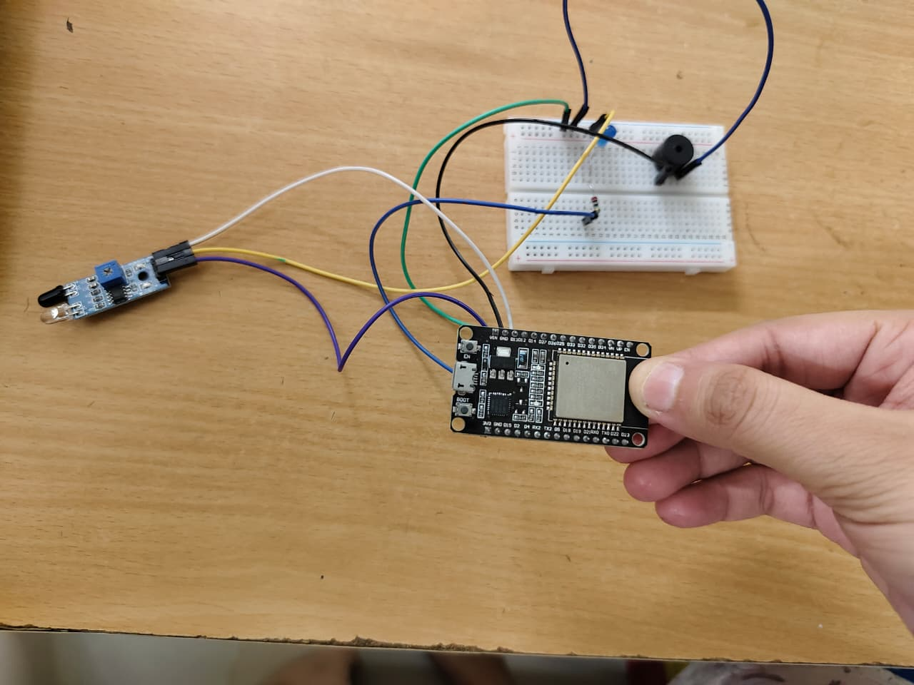

# 🚁 Smart Drone Obstacle Detection and Alert System

## 📌 Overview
The Smart Drone Obstacle Detection and Alert System is an IoT-based project designed to enhance drone safety by detecting obstacles in real time. It uses an IR sensor and ESP32 microcontroller to provide instant alerts and enable remote monitoring through a web dashboard.

---

## 🎯 Features
- Real-time obstacle detection using IR sensor  
- Instant visual (LED) and audible (buzzer) alerts  
- Wi-Fi enabled monitoring using ESP32  
- Live status display on web dashboard  
- AJAX-based auto-refresh (no manual refresh required)  
- Low-cost and efficient system  

---

## 🧰 Components Used
- ESP32 Microcontroller  
- IR Sensor Module  
- LED  
- Buzzer  
- Resistors  
- Jumper Wires  

---

## ⚙️ Working Principle
The IR sensor continuously scans the surroundings. When an obstacle is detected, it sends a signal to the ESP32. The ESP32 activates the LED and buzzer to alert the user.

Simultaneously, the ESP32 hosts a web server over Wi-Fi that displays the system status. The web dashboard shows whether the path is clear or obstructed and updates automatically using AJAX.

---

## 🌐 Web Dashboard
- Displays:
  - "Path Clear" when no obstacle is detected  
  - "Obstacle Detected" when an obstacle is present  
- Accessible through any web browser using ESP32 IP address  

---

## 🖼️ Project Image

### 🔌 Circuit 

---

## 🚀 How to Run the Project

1. Open the `.ino` file in Arduino IDE  
2. Install ESP32 board support (if not already installed)  
3. Enter your Wi-Fi SSID and Password in the code  
4. Upload the code to ESP32  
5. Open Serial Monitor and note the IP address  
6. Enter the IP address in a browser  
7. Monitor obstacle detection in real time  

---

## 🧪 Results
- Accurate obstacle detection within range  
- Immediate LED and buzzer alerts  
- Real-time updates on web dashboard  
- Smooth performance using AJAX  

---

## 📚 Applications
- Drone navigation systems  
- Surveillance drones  
- Autonomous robots  
- Smart safety systems  

---

## 🔮 Future Scope
- Integration with ultrasonic or LiDAR sensors  
- AI-based detection using cameras  
- Mobile application for monitoring  
- Fully autonomous drone system  

---

## ⭐ Conclusion
This project presents a simple, low-cost, and effective solution to improve drone safety using embedded systems and IoT. It enables both real-time alerts and remote monitoring, making it suitable for modern smart applications.
